# Jenkins CI/CD Pipeline — Java Web App

A beginner-friendly, end-to-end CI/CD demo using **Jenkins**, **Maven**, and **Shell Scripting** to build, test, and deploy a Java Servlet web application.



---

## Table of Contents

- [Overview](#overview)
- [Tech Stack](#tech-stack)
- [Project Structure](#project-structure)
- [Prerequisites](#prerequisites)
- [Quick Start — Run Locally](#quick-start--run-locally)
- [Jenkins Pipeline Stages](#jenkins-pipeline-stages)
- [Jenkinsfile Breakdown](#jenkinsfile-breakdown)
- [Deploy Script](#deploy-script)
- [Setting Up Jenkins](#setting-up-jenkins)
- [Common Errors & Fixes](#common-errors--fixes)
- [Project Proof](#project-proof)

---

## Overview

This project demonstrates a local CI/CD pipeline that:

1. **Pulls** the latest code from a GitHub repository
2. **Compiles** a Java Servlet app and packages it as a WAR file using Maven
3. **Runs** JUnit unit tests and publishes results to the Jenkins dashboard
4. **Deploys** the WAR file to a local directory (`/opt/deploy/cicd-demo-app`)

It is designed as a hands-on learning project for anyone getting started with Jenkins and DevOps practices.

---

## Tech Stack

| Tool / Technology | Role |
|---|---|
| Java 11 | Application language |
| Maven 3.8+ | Build tool & dependency manager |
| JUnit 4 | Unit testing framework |
| Javax Servlet API 4.0 | Java web servlet |
| Jenkins (LTS) | CI/CD orchestration |
| Shell Script (`deploy.sh`) | Deployment automation |
| Git / GitHub | Version control & SCM trigger |

---

## Project Structure

```
jenkins-cicd-project/
├── app/
│   ├── pom.xml                          ← Maven build config (Java 11, WAR packaging)
│   └── src/
│       ├── main/
│       │   ├── java/
│       │   │   └── com/demo/
│       │   │       └── HelloServlet.java     ← Main servlet (responds to HTTP GET)
│       │   └── webapp/
│       │       └── WEB-INF/
│       │           └── web.xml              ← Servlet descriptor
│       └── test/
│           └── java/
│               └── com/demo/
│                   └── HelloServletTest.java ← JUnit tests (MUST stay in com/demo/)
├── jenkins/
│   └── Jenkinsfile                      ← Declarative pipeline definition
├── scripts/
│   └── deploy.sh                        ← WAR copy-to-deploy-dir script
├── proof/
│   ├── Doc.docx                         ← Project documentation
│   └── local_deploy.log                 ← Sample deploy output log
├── cicd_pipeline_flow.svg               ← Pipeline architecture diagram
└── README.md
```

> **Important:** `HelloServletTest.java` **must** live in `src/test/java/com/demo/` and declare `package com.demo;` at the top. Moving it out of this package causes Maven to fail to locate `HelloServlet` and breaks the Jenkins build.

---

## Prerequisites

Install the following before running the project:

| Tool | Minimum Version | Download |
|---|---|---|
| Java JDK | 11 | https://adoptium.net |
| Apache Maven | 3.8 | https://maven.apache.org |
| Git | Any | https://git-scm.com |
| Jenkins | LTS | https://www.jenkins.io |

Verify installations:

```bash
java -version
mvn -version
git --version
```

---

## Quick Start — Run Locally

### 1. Clone the repository

```bash
git clone https://github.com/AltamashQureshi/jenkins-cicd-project.git
cd jenkins-cicd-project
```

### 2. Build the application

```bash
cd app
mvn clean package -DskipTests
```

This compiles the Java source and produces:
```
app/target/cicd-demo-app-1.0-SNAPSHOT.war
```

### 3. Run unit tests

```bash
mvn test
```

Both stages should print `BUILD SUCCESS` before you push to Git or trigger Jenkins.

### 4. Deploy manually (optional)

```bash
cd ..   # back to project root
bash scripts/deploy.sh app/target/cicd-demo-app-1.0-SNAPSHOT.war /opt/deploy/cicd-demo-app
```

---

## Jenkins Pipeline Stages

The pipeline is defined in `jenkins/Jenkinsfile` using **Declarative Syntax** and runs four sequential stages:

```
┌───────────┐    ┌───────┐    ┌──────┐    ┌────────┐
│  Checkout │ →  │ Build │ →  │ Test │ →  │ Deploy │
└───────────┘    └───────┘    └──────┘    └────────┘
```

| # | Stage | Command | Output |
|---|---|---|---|
| 1 | **Checkout** | `checkout scm` | Latest code pulled from Git |
| 2 | **Build** | `mvn clean package -DskipTests` | `cicd-demo-app-1.0-SNAPSHOT.war` |
| 3 | **Test** | `mvn test` | JUnit XML reports published to Jenkins |
| 4 | **Deploy** | `bash scripts/deploy.sh` | WAR copied to `/opt/deploy/cicd-demo-app/` |

If any stage fails, the pipeline stops immediately and marks the build as **FAILED**.

---

## Jenkinsfile Breakdown

```groovy
pipeline {
    agent any

    environment {
        APP_NAME   = "cicd-demo-app"
        DEPLOY_DIR = "/opt/deploy/${APP_NAME}"
        WAR_FILE   = "app/target/${APP_NAME}-1.0-SNAPSHOT.war"
    }

    stages {
        stage('Checkout') { ... }   // pulls latest code via SCM
        stage('Build')    { ... }   // mvn clean package -DskipTests
        stage('Test')     { ... }   // mvn test + publishes JUnit XML results
        stage('Deploy')   { ... }   // runs deploy.sh with WAR path + deploy dir
    }

    post {
        success { echo "Pipeline PASSED!" }
        failure { echo "Pipeline FAILED!" }
        always  { echo "Status: ${currentBuild.result}" }
    }
}
```

Key environment variables set in the pipeline:

| Variable | Value |
|---|---|
| `APP_NAME` | `cicd-demo-app` |
| `DEPLOY_DIR` | `/opt/deploy/cicd-demo-app` |
| `WAR_FILE` | `app/target/cicd-demo-app-1.0-SNAPSHOT.war` |

---

## Deploy Script

`scripts/deploy.sh` accepts two arguments and safely copies the WAR to the target directory:

```bash
bash scripts/deploy.sh <war-file> <deploy-dir>
```

What it does:
- Validates that both arguments are provided
- Confirms the WAR file exists before deploying
- Creates the deploy directory if it doesn't exist (`mkdir -p`)
- Copies the WAR file to the target location
- Exits immediately on any error (`set -e`)

---

## Setting Up Jenkins

### 1. Install Jenkins

Follow the official guide: https://www.jenkins.io/doc/book/installing/

### 2. Install required plugins

In Jenkins → Manage Jenkins → Plugins, ensure these are installed:

- **Git Plugin** — for SCM checkout
- **Maven Integration Plugin** — for Maven build steps
- **Pipeline Plugin** — for Declarative Pipeline support
- **JUnit Plugin** — for publishing test reports

### 3. Configure Maven in Jenkins

Jenkins → Manage Jenkins → Tools → Maven installations → Add Maven (name it `Maven`, point to your install or use auto-install).

### 4. Create a Pipeline job

1. New Item → **Pipeline** → give it a name → OK
2. Under **Pipeline**, set **Definition** to `Pipeline script from SCM`
3. Set **SCM** to `Git` and paste the repository URL
4. Set **Script Path** to `jenkins/Jenkinsfile`
5. Save and click **Build Now**

### 5. Push changes to trigger builds

Once configured, every `git push` to the watched branch will automatically trigger a new pipeline run.

---

## Common Errors & Fixes

| Error | Cause | Fix |
|---|---|---|
| `package com.demo does not exist` | Test file is in wrong directory | Move `HelloServletTest.java` to `src/test/java/com/demo/` |
| `WAR file not found` | Build was skipped or failed | Run `mvn clean package -DskipTests` manually first |
| `Permission denied: /opt/deploy` | Jenkins user lacks write access | Run `sudo chown -R jenkins:jenkins /opt/deploy` |
| `mvn: command not found` | Maven not on PATH in Jenkins | Configure Maven under Jenkins → Tools |
| `BUILD FAILURE` on tests | Unit test assertion failed | Check `app/target/surefire-reports/` for detailed failure report |

---

## Project Proof

The `proof/` directory contains:

- `Doc.docx` — Full project write-up and documentation
- `local_deploy.log` — A sample log captured from a successful local deployment run

---

## Author

**Altamash Qureshi**
GitHub: [@AltamashQureshi](https://github.com/AltamashQureshi)
